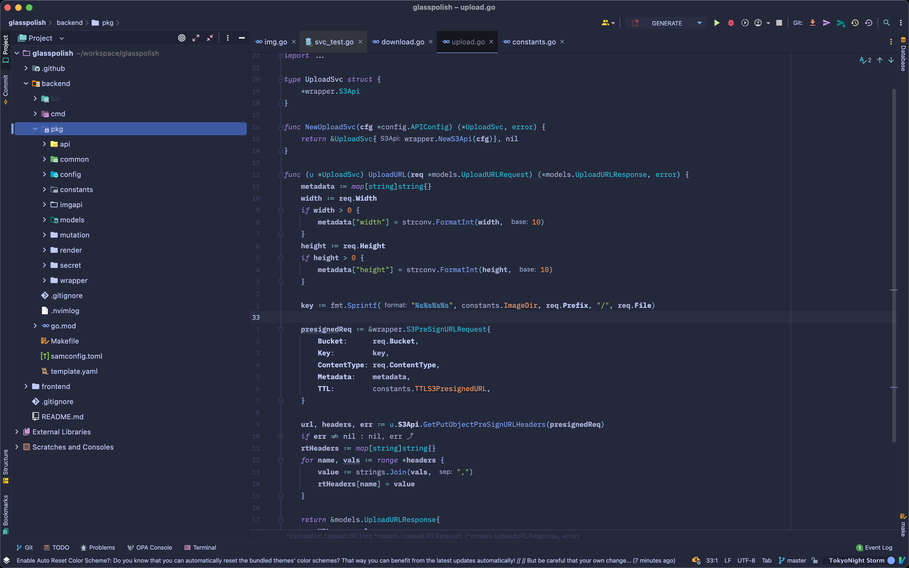
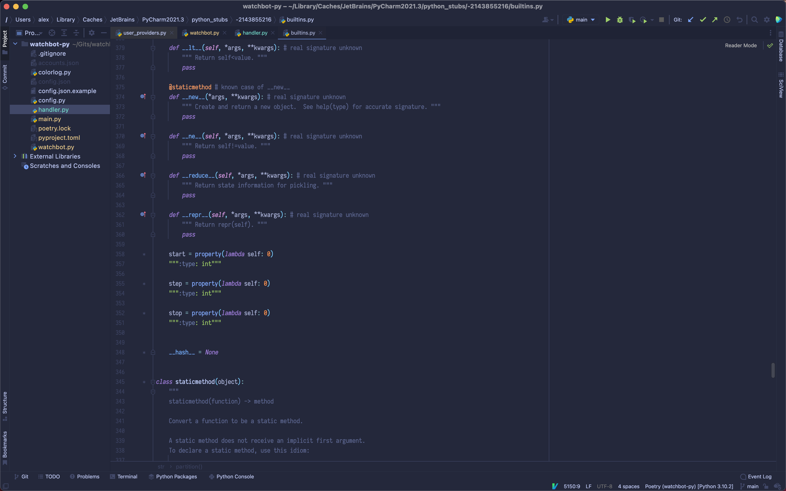
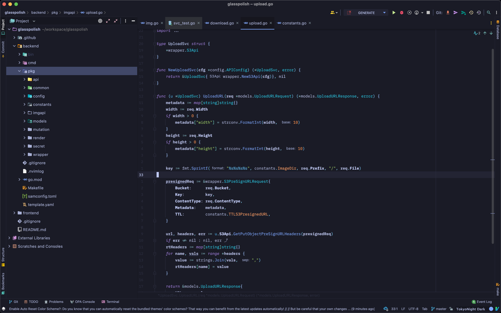
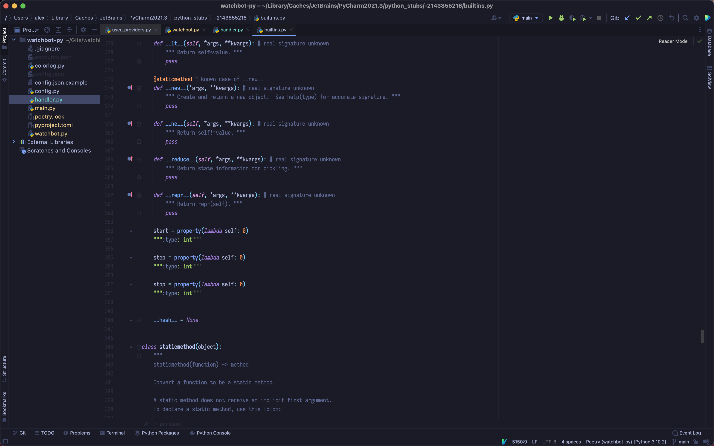

# 🏙 Tokyo Night

A dark and light Jetbrains theme ported from the Visual Studio Code [TokyoNight](https://github.com/enkia/tokyo-night-vscode-theme) theme.

There are 2 variants here:

- TokyoNight Storm

    
    

- TokyoNight Dark

    
    

## Differences between this one and the theme by Grafikart

- Main difference is just this theme includes the UI theme too, without relying on the user to install Material UI theme. 
- Otherwise everything is (about) the same. 
- Go checkout his theme as well if you think that this one doesn't fit you: [https://github.com/Grafikart/tokyo-night-jetbrains-theme](https://github.com/Grafikart/tokyo-night-jetbrains-theme)

## Installation

*On Your Jetbrains IDE*:

- <kbd>Open Settings/Preferences</kbd>
- <kbd>Plugins</kbd>
- <kbd>Marketplace</kbd>
- <kbd>Search for "TokyoNight Theme"</kbd> >
- <kbd>Install Plugin</kbd>

Copyright &copy; 2022-present <a href="https://github.com/alexadhy" target="_blank">Alexander Adhyatma</a>
